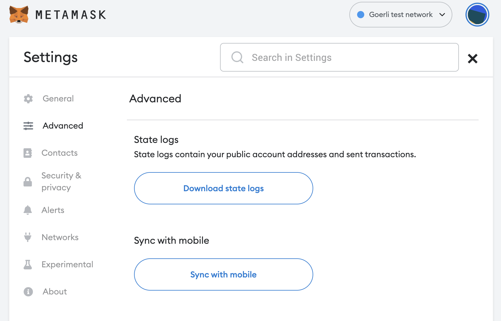
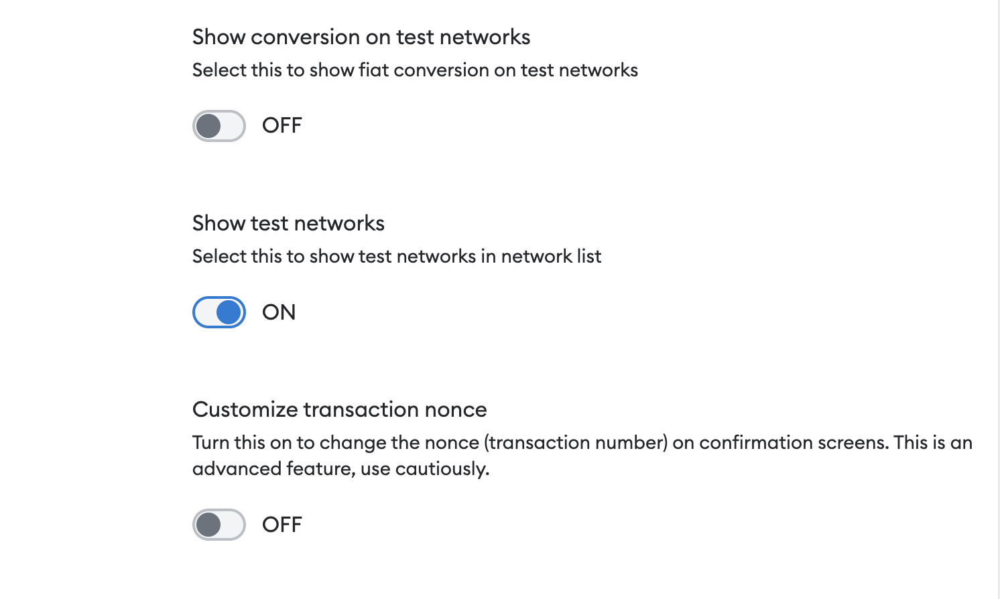
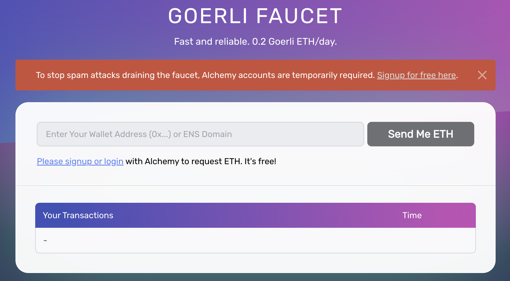

# Georli Process

Link to faucet & signing up for alchemy - https://goerlifaucet.com/ 

Link providing a guide on how to - https://egghead.io/lessons/solidity-deploy-your-smart-contract-to-goerli-test-network-and-app-to-vercel?utm_source=rss&utm_medium=feed&utm_campaign=rss_feed

- The first step is to connect your MetaMask wallet to the Goerli test network. Do this directly in the MetaMask UI at the top. Select Goerli. After that, be sure that you are using the main account and not the one you imported from the local chain.
Adding Georli test network if your advanced setting is locked

- You will then need to signup to Alchemy and verify your email address

- In the signup process it will require your card details at some point but because you selected 'free' it does not charge your card
- Check your email to confirm the sign-up process. When that is done, you'll be back in the faucet page. Now, you can enter your wallet address and request some ETH. The transaction could take a bit. After that is done, check your wallet. You'll see a bit of Goerli ETH available.

- You can then run this through remix 

