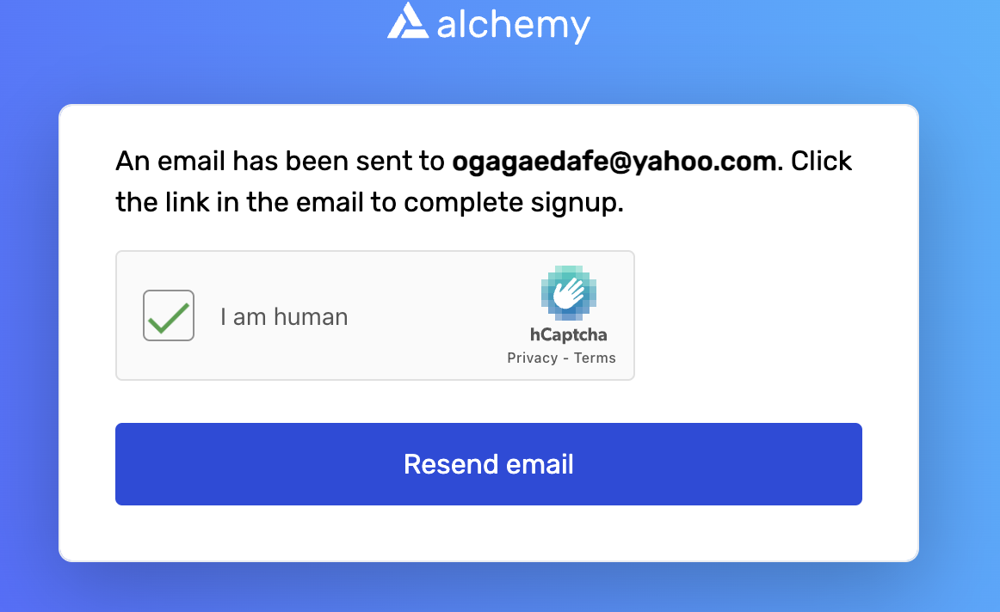

An auction is a sales event wherein potential buyers place competitive bids on assets or services either in an open or closed format. Auctions are popular because buyers and sellers believe they will get a good deal buying or selling assets. It usually involves the process of buying and selling goods or services by offering them up for bids, taking bids, and then selling the item to the highest bidder or buying the item from the lowest bidder.

When we hear of an auction our thoughts naturally gravitate to a lot of people in one room being engaged by the auctioneer. This still occurs till today for certain commodities. However, there are also quite a number of auctions conducted online via various platforms.

Pros of Auctions
- Seller controls process
- You can find rare items 
- Buy at a discount if allowed 
- Seller can maximize bargaining power 

Cons of Auctions
- Competitive process can deter some buyers
- Competitive bidding process can drive up price

### EXECUTIVE SUMMARY

An NFT auction is an internet platform that allows the trading of non-fungible tokens for a fixed price or at an auction amount. Our platform was built to enable the buy and sell of various NFT’s. 
The fintech industry can be seen as a rearing ground for adoption of this emerging technology. Existing companies may deploy smart contract to make their processes more cost and time efficient. The use of smart contracts in the fintech industry can be seen as a solution that can enable more efficient monitoring and execution of complex and large derivative contracts are usually based on comprehensive master agreements. For instance, payment related provisions of a contract that requires one party to pay a certain amount to another party upon the completion of certain events e.g., an auction bid being approved can be coded into a smart contract which will enable an automatic execution.

## Backend

The backend is made up of two contracts. First, the NFT contract. This allows a user to mint an NFT, among other functions, and is used by us to create an NFT that we can use in our auction contract.

### Deploying and Testing in Remix

First we deploy our nft.sol contract, specifically "MyNFT". On deployment of this contract we go into the contract and mint an NFT. We choose our address, in this case the first address in our Remix list of addresses, and input a NFT ID, in this case we choose 42 (we can choose any number).

Second, we deploy our Auction.sol contract. Within the constructor of our auction contract there are a few parameters we need to input.
In the address field we enter the address of the nft.sol contract which can be copied at the right of the deployed nft contract. We enter the ID of the NFT that we entered earlier (42).
We enter a startingBid which essentially acts as a minimum bid that must be exceeded by subsequent bidders. The startingBid is denominated in wei.
Finally, we enter a "biddingTime" which is the duration, in seconds, of our auction.
Hit transact and our auction contract is deployed.

Our auction contract will take ownership of the NFT we will be selling. As such, we the owner of the NFT need to approve this transfer. Back in the deployed nft.sol, we go to the Approve function, copy the address of the auction.sol contract and paste it into the address field, and enter the NFT ID (42).
Our contract is now approved to take ownership of the NFT.

Now we can begin. We start the auction by clicking the "startAuction" function. The address used when starting the auction must be the same one used when deploying the contract - in other words, the seller must start the auction.

Users are now able to bid. First, choose the second address in our address list as the owner of the auction contract cannot make bids. Put a value in the "Value" field. Ensure it is higher than the startingBid we set when we deployed the contract. Click "Bid" to make the bid.

Choose another address and repeat the process with yet a higher bid.

---

We can now check some of the variables in our contract.

At the bottom of our function list, we fist click "started". This function checks if the contract has started, and as of course it has, the value returned is the boolean "true".

The "seller" function returns the address of the seller. We can see that it matches the first address in our list, the address used to deploy the contracts.

The "nftId" function returns the id we entered when deploying our nft contract and auction contract. In this case it is "42".

The "nft" function returns the address of our nft.sol contract, the original owner of the nft.

The highestBidder shows the address of the highest bidder. The highestBid shows the value of the highest bid.

We can also check the bids based on an entered address. We copy the address from our list and the function returns the highest value bid of that user.

Finally, provided the duration of the auction has expired, we can click on the endAuction function. This function will transfer ownership of the nft to the highest bidder, and transfer the highestBid to the owner of the auction.

We can check the current owner of the nft by returning to the nft.sol contract, and at the ownerOf function, enter the nftId, and return the address of the owner. This will display the new owner which we can compare with our address list.

As we see, the owner of the NFT is the auction smart contract. This is a clear demonstration of the removal of the intermediary and it's replacement with code.

The unsuccessful bidders can now withdraw their ether. Set the address to the address of the bidder and click the withdraw function.

Our auction has ended. Ownership of the NFT has been transferred to the highest bidder. The seller has received the value in wei of the highest bid. Unsuccessful bidders have withdrawn their ether.

---

### Testing with Metamask and Ganache

To begin testing in Remix with the Metamask wallet we first need to change our Environment to the Injected Proveider - MetaMask" selection.

Once MetaMask is selected, the MetaMask wallet will automatically open, promting the user for a password.

We previously set up a new network on MetaMask named "Ganache". This uses the RPC Server "HTTP://127.0.0.1:7545" taken from the program "Ganache".

From ganache app we import the private keys of the first two accounts into MetaMask, thereby connecting these two ganache test accounts and their ether to MetaMask.

Within MetaMask, set the network provider to "Ganache".

Now, with every transaction made using our solidity contracts, MetaMask will be called and the user will be prompted to authorize each transaction.

------

# Georli Process

Link to faucet & signing up for alchemy - https://goerlifaucet.com/ 

Link providing a guide on how to - https://egghead.io/lessons/solidity-deploy-your-smart-contract-to-goerli-test-network-and-app-to-vercel?utm_source=rss&utm_medium=feed&utm_campaign=rss_feed

- The first step is to connect your MetaMask wallet to the Goerli test network. Do this directly in the MetaMask UI at the top. Select Goerli. After that, be sure that you are using the main account and not the one you imported from the local chain.
Adding Georli test network if your advanced setting is locked

- You will then need to signup to Alchemy and verify your email address

- In the signup process it will require your card details at some point but because you selected 'free' it does not charge your card
- Check your email to confirm the sign-up process. When that is done, you'll be back in the faucet page. Now, you can enter your wallet address and request some ETH. The transaction could take a bit. After that is done, check your wallet. You'll see a bit of Goerli ETH available.

- You can then run this through remix 

----

### Testing with Truffle

To begin, we created a new directory specifically for the truffle testing. Within this folder type:

truffle init

Upon completion truffle will create three new directories for us to put our files into:

- contracts (for our solidity smart contracts)
- migrations (which will hold our compliled smart contracts)
- tests (which will hold our test scripts)

We then added our completed solidity contracts (auction.sol, nft.sol) to our contracts folder.

Then we need to compile our contracts:

truffle compile

Compiling will then create a new directory: "build". And within this we will find our contracts compiled into json files.

Note that all smart contracts, including inherited contracts are compiled.

We need to write our script that will tell truffle what functions etc to test. This is written in node.js and is found in the test directory.

We define what we are trying to achieve in our test, and set the functions we will call from our smart contract, including any parameters.

In our case we behan by simply deploying the auction.sol contract, including the parameters.

To run the test:

truffle test

As you can see from the above screenshot, the test passed.

---
## Front-End app Demo 

---
## Key inputs and Steps (as shown in Demo)

1. Compile both `nftRegistry.sol` and `modifiedAuction.sol` contracts in Remix.

2. Deploy `nftRegistry.sol` contract.

3. update smart_contract_address in `.env`

4. streamlit run `nft.py`.

5. Owner of minted NFT itself must be the one of deploying the **auction** contact. (NFT owner and Auction Contract Seller must be the same).
6. When deploying `auction.sol` auction contract, both `minted token_ID` and `Smart Contract` address are required. (One auction contract for one NFT_ID sale)

7. update auction_contract_address in `.env`

8. Before auction contract ready, the owner of NFT must click `approve` to approve **its NFT_ID** together with **auction contract address** inside Remix Solidity `Smart Contract`.

9. Fresh re-start streamlit run `nft.py`

10. From front end, when auction contract is realy, Only onwer of NFT can `start` the auction, and time is counting down.
11. Any address can `close` the auction ONLY after auction time ended.
